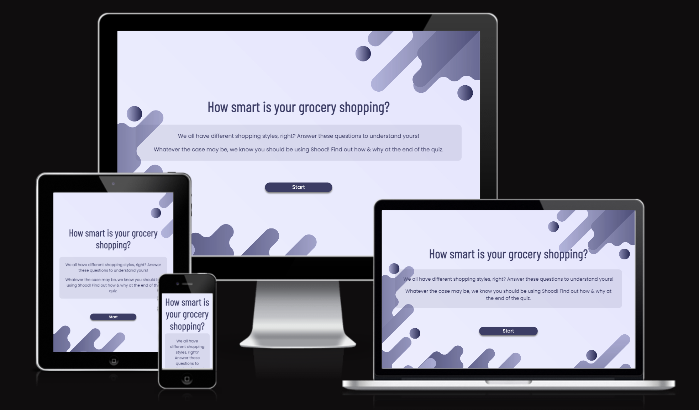
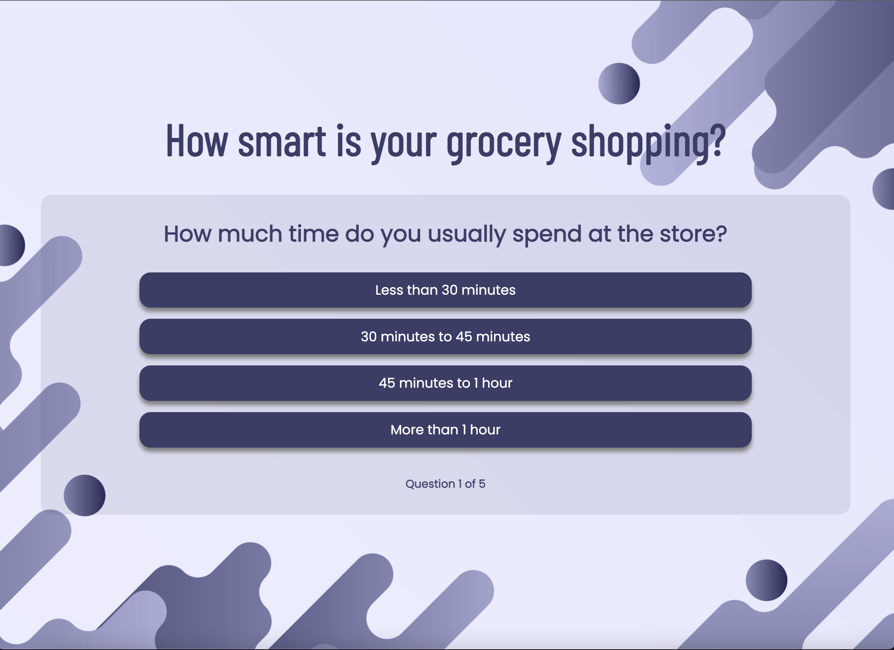
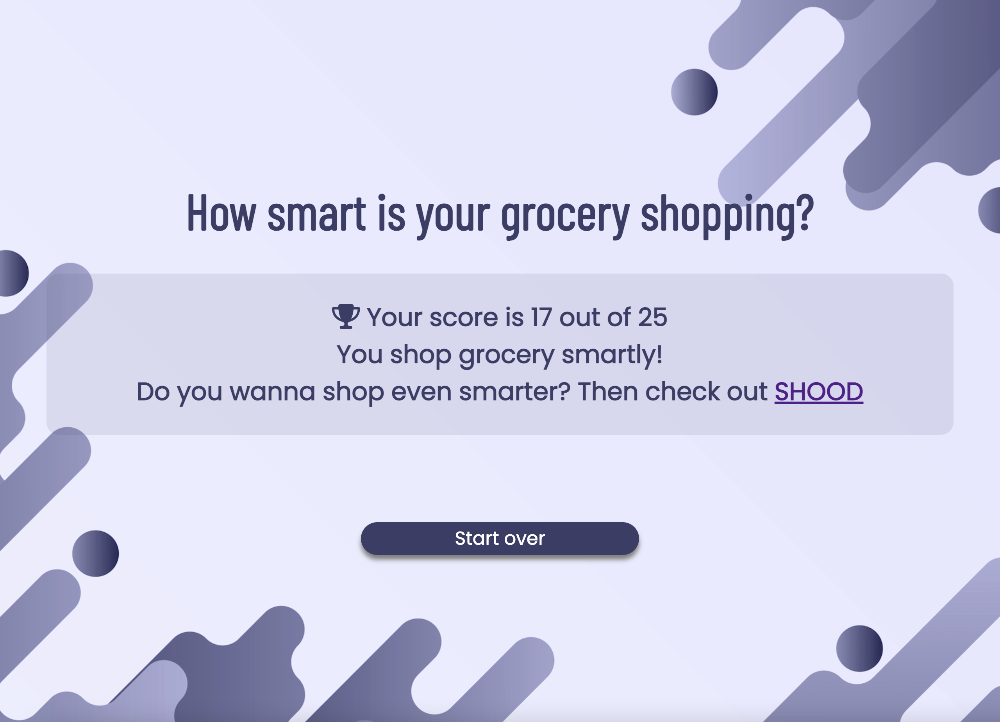
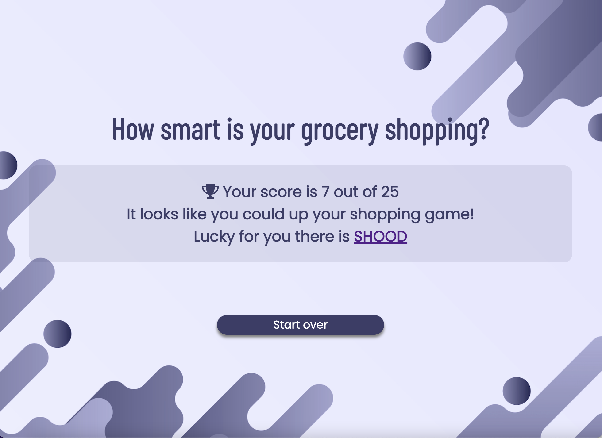
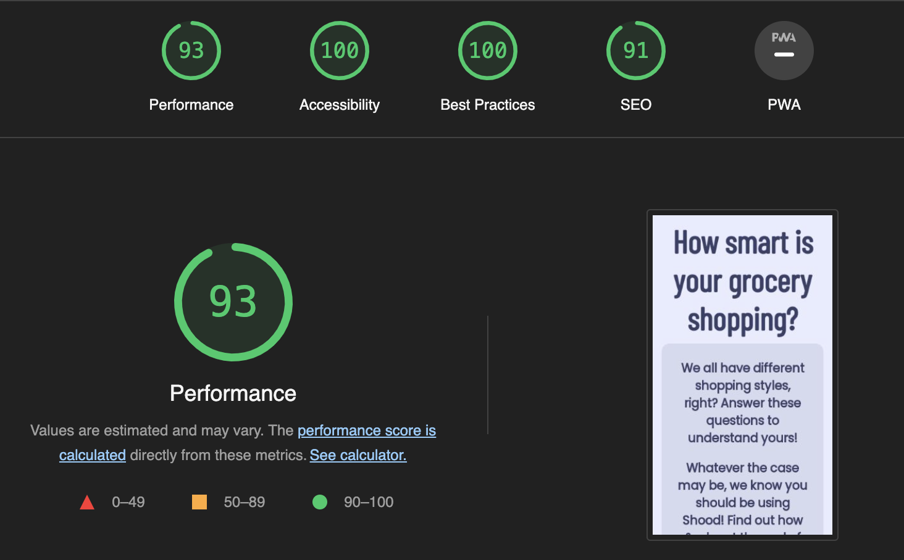

# Smart shopping quiz
You can see the live link [here.](https://mjrosi.github.io/second-portfolio/)

This quiz asks five questions about grocery shopping habits. This project is related to my first project, [SHOOD](https://mjrosi.github.io/my-first-portfolio/) which is a search and comparison engine. In this quiz each option of the questions has a point from 1 to 5. Total points is 25. At the end of the quiz the total score is calculated and user can see it, along with two different messages, deponding on user's score.

## Features 

### Existing Features

- __Start section__
  - This section will provide the user information about the quiz.
  - A start button which start the quiz.

- __Question secction__

  - This section display the questions and options. Total number of questions are five. Each question has four options.
  - After choosing an option, next questions and options will automatically load.
  - There is a progress bar at the bottom of this section which shows he number of answered questions of total questions.

- __Score section__

  - The score section will allow the user to see the score. The total score is 25. 
  - If the user's score is more than 17, this message will show: "You shop grocery smartly!
Do you wanna shop even smarter? Then check out [SHOOD](https://mjrosi.github.io/my-first-portfolio/)", which encourage the user to check out the SHOOD website.
  - If the user's score is less than 17, this message will show: "It looks like you could up your shopping game!
Lucky for you there is [SHOOD](https://mjrosi.github.io/my-first-portfolio/)", which recommond the user to check out the SHOOD website for a smart grocery shopping service.
  - A start-over button for reset the quiz and back to the start section. 

## Testing
- I tested that this page works in different browsers: Chrome, Firefox, Safari.
- I confirmed that this project is responsive, looks good and functions on all standard screen sizes using the devtools device toolbar.
- I confirmed that the title, text in start section, all questions and options and button text are all readable.
- I have confirmed that the start-button and start-over button are working.
- I have confirmed that the showing questions and options are working.
- I have confirmed that the calculation of the score is correct and showing the score is working.

### Validator Testing 

- HTML 
  - No errors were returned when passing through the official [(W3C) validator](https://validator.w3.org/nu/?doc=https%3A%2F%2Fmjrosi.github.io%2Fsecond-portfolio%2F).

- CSS
  - No errors were found when passing through the official [(Jigsaw) validator](https://jigsaw.w3.org/css-validator/validator?uri=https%3A%2F%2Fmjrosi.github.io%2Fsecond-portfolio%2F&profile=css3svg&usermedium=all&warning=1&vextwarning=&lang=en).

- JavaScript
  - No errors were found when passing through the official [(jshint)](https://jshint.com/).

- Accessibility
  - I confirmed that the colors and fonts chosen are easy to read and accessible by running it through lighthouse in devtools.

### Unfixed Bugs
No unfixed bugs. 

## Deployment

- The site was deployed to GitHub pages. The steps to deploy are as follows: 
  - In the GitHub repository, navigate to the Settings tab 
  - From the source section drop-down menu, select the Main Branch
  - Once the main branch has been selected, the page will be automatically refreshed with a detailed ribbon display to indicate the successful deployment. 

The live link can be found here - https://mjrosi.github.io/second-portfolio/

## Credits 

### Content 

- The code to the start over button event, location.reload(), is taken from [here](https://www.freecodecamp.org/news/refresh-the-page-in-javascript-js-reload-window-tutorial/).
- The icons in the score section is taken from [Font Awesome](https://fontawesome.com/).

### Media

- The backgroubd image is taken from [freepik](https://www.freepik.com/).
